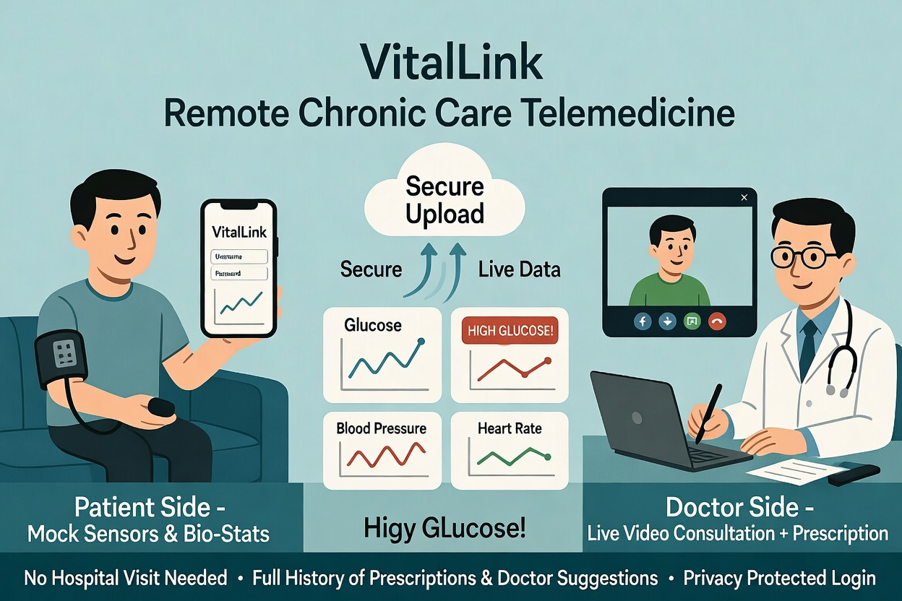

# SW_Final_Project
---
# Graphical Abstract

---
# Purpose of the Software

**Type of software development process applied:**  
Agile (Scrum-style with short iterative sprints).

**Why we chose Agile (instead of Waterfall):**  
We chose **Agile** because our project had a very short timeline of only **one month** and the requirements evolved during development (e.g., adding login for privacy, full prescription history, and live video consultation). Agile allowed us to build, test, and improve features every week instead of waiting until the end. Waterfall would have been too rigid and risky — any change in the middle (like adding the Jitsi Meet live video) would have required restarting the whole process. Agile gave us flexibility, early feedback, and the ability to deliver a working pilot version on time.

**Possible usage of the software (target market):**  
VitalLink is designed for patients in Macau (and similar cities) who suffer from chronic illnesses such as diabetes or hypertension. These patients normally need to visit the hospital or clinic very frequently just to measure bio-stats and collect medicine. With VitalLink, patients can upload their data from home using mock sensors, attend a live video consultation with their doctor, and receive digital prescriptions instantly. The target market includes:
- Elderly or busy chronic patients who want to avoid long waiting times and travel.
- Doctors and clinics that want to reduce in-person visits and provide better remote care.
- Macao’s healthcare system, which can use this model to ease hospital congestion.
---
# Software Development Plan

## Development Process
We followed the **Agile** methodology using a clear iterative cycle:

**Requirements → Development → Testing → Evolution**

This cycle was repeated in every sprint, allowing us to deliver working features quickly and continuously improve the software within the one-month project schedule. Because we used Agile, whenever we found any problem or new requirement during Testing or Evolution, we could **immediately go back** to update the related documents (SRS, README, or previous sprint deliverables) without restarting the entire project.

### Requirements Phase
In this phase we gathered and refined all functional and non-functional needs of VitalLink.  
We created and updated the **Software Requirements Specification** and the main README.md. Key activities included:
- Defining user roles (Patient and Doctor) with login for privacy protection
- Specifying mock sensor input, bio-stat history, live video consultation (WebRTC), and full prescription history with doctor suggestions
- Documenting the target market (chronic illness patients in Macau) and technical constraints (Python + Streamlit)
All requirements were reviewed and adjusted at the start of each sprint.

#### Software Requirements Specification (SRS)  
**VitalLink – Remote Chronic Care Telemedicine App**

**Project Title:** VitalLink  
**Version:** 1.0 (Pilot / Demo Version with Login & History)  
**Date:** April 2026  
**Group Members:** [Insert your 4 names here]  
**Course:** COMP2116 Software Engineering  
**Macao Polytechnic University**

##### 1. Introduction

###### 1.1 Purpose
This document describes the functional and non-functional requirements of **VitalLink**, a Python-based telemedicine web application for patients with chronic illnesses (diabetes, hypertension). The system enables secure remote bio-stat monitoring, **login-protected access**, **live video consultation**, and digital prescriptions — eliminating frequent hospital visits.

###### 1.2 Scope
**In Scope (Pilot Version):**  
- Patient-side mock sensor data collection and history visualization  
- Doctor-side real-time monitoring with alerts and trend analysis  
- **Login authentication** for both Patient and Doctor to protect privacy  
- **Live video and audio consultation** (WebRTC)  
- Electronic prescriptions with doctor suggestions/notes  
- **Patient can view full personal history** including all past prescriptions and doctor suggestions  
- Secure local database storage  

**Out of Scope (Future releases):**  
- Real IoT sensor integration  
- Cloud deployment and advanced authentication (e.g., JWT, OAuth)  
- AI predictive analytics  

### 1.3 Definitions, Acronyms, and Abbreviations
- **Bio-stat**: Blood glucose, blood pressure (systolic/diastolic), heart rate.  
- **Mock Sensor**: Simulated data entry.  
- **Live Video Consultation**: Real-time WebRTC via Jitsi Meet iframe.  
- **SRS**: Software Requirements Specification.

##### 2. Overall Description

###### 2.1 Product Perspective
VitalLink replaces physical clinic visits with a secure, privacy-protected remote system using login, live video, and full historical records of doctor suggestions.

###### 2.2 Product Functions
- Login for privacy protection  
- Patient: input sensor data, view full history (bio-stats + prescriptions + doctor suggestions)  
- Doctor: monitor patients, conduct live video calls, issue prescriptions with suggestions  
- Persistent storage of all data

###### 2.3 User Classes and Characteristics
| User Class     | Description                                      | Characteristics                          |
|----------------|--------------------------------------------------|------------------------------------------|
| Patient        | Chronic illness patient                          | Non-technical users needing privacy      |
| Doctor         | Registered physician                             | Medical professional                     |

###### 2.4 Operating Environment
- **Platform**: Web browser with WebRTC support  
- **Programming Language**: Python 3.10+  
- **Framework**: Streamlit  
- **Database**: SQLite (`vitalink.db`)  
- **Video Call**: Embedded WebRTC  
- **Hardware**: Standard laptop with webcam/microphone

###### 2.5 Design and Implementation Constraints
- Entirely in **Python**  
- Simple login (username/password) for demo privacy protection  
- All data stored locally  
- Runnable with `streamlit run app.py`

###### 2.6 Assumptions and Dependencies
- Demo credentials only (no real medical data)  
- Users have webcam/microphone for video call

##### 3. Specific Requirements

###### 3.1 Functional Requirements

###### 3.1.1 Authentication Module (New)
| ID     | Requirement                                                                 | Priority |
|--------|-----------------------------------------------------------------------------|----------|
| FR-A1  | Both Patient and Doctor must log in with username & password               | Must     |
| FR-A2  | Login protects access to personal data and consultation features            | Must     |
| FR-A3  | Session-based login (remains active during the app session)                 | Must     |

###### 3.1.2 Patient Module
| ID     | Requirement                                                                 | Priority |
|--------|-----------------------------------------------------------------------------|----------|
| FR-P1  | After login, enter mock sensor data                                         | Must     |
| FR-P2  | View personal bio-stat history                                              | Must     |
| FR-P3  | **View full history of past prescriptions and doctor suggestions**          | Must     |
| FR-P4  | Join live video consultation                                                | Must     |

###### 3.1.3 Doctor Module
| ID     | Requirement                                                                 | Priority |
|--------|-----------------------------------------------------------------------------|----------|
| FR-D1  | After login, view all patients                                              | Must     |
| FR-D2  | Generate health alerts and trend charts                                     | Must     |
| FR-D3  | Conduct live video consultation                                             | Must     |
| FR-D4  | Create prescription including medicine, dosage, **and suggestions/notes**   | Must     |

###### 3.1.4 Live Video Consultation Module
| ID     | Requirement                                                                 | Priority |
|--------|-----------------------------------------------------------------------------|----------|
| FR-V1  | Both roles can join the same WebRTC Meet room after login                   | Must     |

###### 3.1.5 System Functions
| ID     | Requirement                                                                 | Priority |
|--------|-----------------------------------------------------------------------------|----------|
| FR-S1  | All bio-stats and prescriptions stored persistently                         | Must     |
| FR-S2  | Patient can retrieve complete personal history                              | Must     |

###### 3.2 Non-Functional Requirements
| Category          | Requirement                                                                 | Target       |
|-------------------|-----------------------------------------------------------------------------|--------------|
| Security          | Simple login to protect privacy (demo level)                                | High         |
| Usability         | Clear login screen + intuitive dashboards                                   | High         |
| Reliability       | All history data saved and retrievable                                      | Must         |
| Performance       | Login < 2s, charts and video load instantly                                 | High         |

###### 3.3 Algorithm Requirements
- Health alerts (same as before)  
- History retrieval using SQL queries filtered by logged-in patient name

##### 4. Appendix

###### 4.1 Graphical Abstract
*(Update your image to show: Login screen → Patient/Doctor dashboard → Live video + History tab with prescriptions & suggestions)*

###### 4.2 Traceability
All new requirements (FR-A1~A3, FR-P3) are implemented in `app.py` v1.0.

###### End of SRS Document v1.0
---
#### Development Phase
In this phase we implemented the features according to the latest requirements.  
We worked directly on the source code (`app.py`) and supporting files. Major development activities included:
- Building the secure login system and session management
- Creating the Patient dashboard (mock sensor data input, bio-stat charts using Plotly, and full history view)
- Developing the Doctor dashboard (patient list, automatic health alerts, trend analysis)
- Integrating live video consultation using Jitsi Meet iframe
- Implementing the prescription module with medicine, dosage, and doctor suggestions/notes
- Connecting everything to the SQLite database for persistent storage
All code was committed to GitHub after each feature was completed.

#### Testing Phase
In this phase we verified that the implemented features worked correctly and met the requirements.  
Testing was performed after every sprint and included:
- Functional testing: login success/failure, sensor data saving, chart display, live video call joining, prescription saving and retrieval
- Integration testing: ensuring Patient history shows both bio-stats and doctor prescriptions
- Usability testing: checking that the interface is clear for non-technical patients
- Compatibility testing: running the app on different browsers
- Privacy testing: confirming that users can only see their own data after login
Any bugs or missing features discovered here were immediately recorded and fed back into the next Requirements or Development phase.

#### Evolution Phase
In this phase we reviewed the results of Testing and improved the software and documentation.  
We applied lessons learned and made the following enhancements:
- Updated the SRS and README when new features (e.g., full prescription history) were added
- Refined the health alert algorithm and UI layout based on internal feedback
- Improved code comments and added the Graphical Abstract
- Prepared the final demo video script and polished the GitHub repository
Because of the Agile approach, any issues found during Evolution could be fixed by directly changing earlier documents or code, ensuring the final product remained consistent and high-quality.

This iterative Requirements → Development → Testing → Evolution cycle allowed us to deliver a fully working pilot version of VitalLink on time within one month.

### Members (Roles & Responsibilities & Portion)
| Member              | Role & Responsibilities                              | Portion |
|---------------------|------------------------------------------------------|--------|
| Alan                | Project Manager, Backend & Database, Login system    | 25%    |
| [Member 2 Name]     | UI/Streamlit Development & Data Visualization        | 25%    |
| [Member 3 Name]     | Sensor Simulation, Algorithm, Live Video Integration | 25%    |
| [Member 4 Name]     | Testing, Documentation, Demo Video & Final Polish    | 25%    |

*(Please replace the three “[Member X Name]” with your actual group members’ names.)*

### Schedule (Completed within 1 month – April 2026)
- **Week 1 (Sprint 1)**: Project setup, GitHub repo, SRS document, login system, database design  
- **Week 2 (Sprint 2)**: Patient dashboard (sensor input, bio-stat history), Doctor dashboard (patient list & charts)  
- **Week 3 (Sprint 3)**: Live video consultation (Jitsi Meet), prescription module with doctor suggestions  
- **Week 4 (Sprint 4)**: Full history for patients, health alerts, testing, documentation (README + SRS), demo video recording, final submission

### Algorithm*
**Health Alert Algorithm** (simple rule-based system):
- Blood Glucose > 180 mg/dL → “HIGH GLUCOSE!” alert (red)
- BP Systolic > 140 mmHg → “HYPERTENSION!” alert (red)
- Otherwise → “Normal”

**History Retrieval Algorithm**:  
SQL query filters all records by the logged-in patient’s username to display complete bio-stat history + every past prescription and doctor suggestion.

### Current Status of Your Software
The software is a **fully functional pilot (MVP)**. All required features are working:
- Secure login (privacy protected)
- Patient: mock sensor input, full bio-stat history, full prescription & doctor suggestion history
- Doctor: view all patients, automatic alerts, trend charts
- Live video consultation (real WebRTC via Jitsi Meet)
- Digital prescriptions with suggestions
- Data is stored persistently in SQLite

The app runs locally with one command: `streamlit run app.py`. It is ready for demonstration.

### Future Plan
- Integrate real IoT wearable sensors (Bluetooth/Raspberry Pi)
- Add full user authentication and cloud database (Firebase/AWS)
- Enable real-time video recording and prescription PDF export
- Add AI-based risk prediction for glucose/BP trends
- Deploy on Streamlit Community Cloud or a web server for actual hospital use

---
